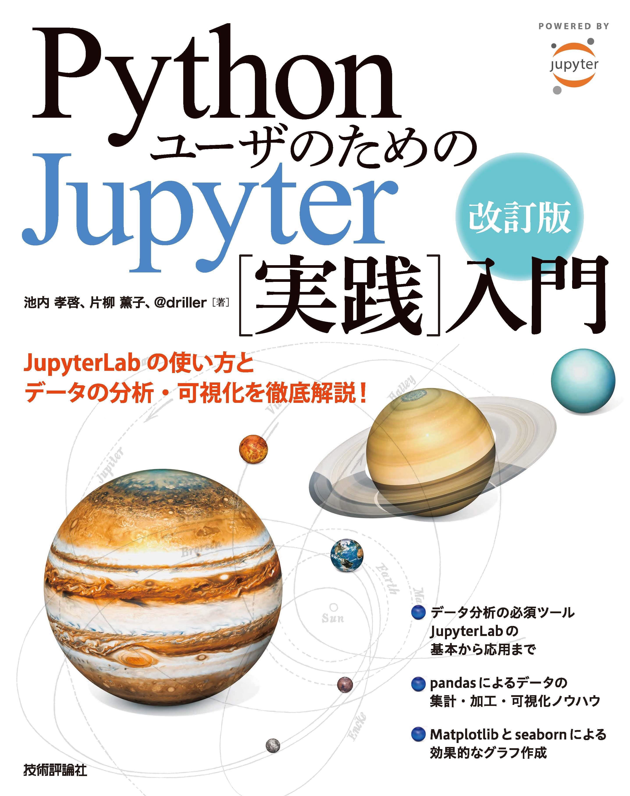

# 改訂版 Pythonユーザのための Jupyter[実践]入門

* [書籍公式ページ](https://gihyo.jp/book/2020/978-4-297-11568-5)
* TBD: [公式サポートページ（正誤表）]()

## サンプルコードについて

* 書籍に掲載されているコードとはレイアウト（改行位置など）が異なる部分がありますが、内容は同じものです
* コードに問題点などがあった場合は [issues](https://github.com/practical-jupyter/sample-code-2nd/issues) にご連絡ください
* 書籍と異なるバージョンでは動作しない場合があります

## binder

下記のリンクからNotebookを実行できます

## サンプルコード

* nbviewer: [nbviewer](https://nbviewer.jupyter.org)でレンダリングされたものが表示されます
* Open in Colab: [Colaboratory](https://colab.research.google.com/)上で実行できます

### 第3章 pandasでデータを処理しよう

章-節|タイトル|nbviewer|Open in Colab
-----|--------|--------|-------------
3-2|サンプルデータについて||
3-3|Series||
3-4|DataFrame||
3-5|さまざまなデータの読み込み||
3-6|データの前処理||
3-7|テキストデータの処理||
3-8|時系列データの処理||
3-9|基本統計量の算出||
3-10|データの結合||
3-11|データの集計||
3-12|データの可視化||

### 第4章 Matplotlibでグラフを描画しよう

章-節|タイトル|nbviewer|Open in Colab
-----|--------|--------|-------------
4-2|グラフの描画||
4-3|折れ線グラフ||
4-4|散布図||
4-5|棒グラフ||
4-6|ヒストグラム||
4-7|箱ひげ図||
4-8|円グラフ||

### 第5章 Matplotlibを使いこなそう

章-節|タイトル|nbviewer|Open in Colab
-----|--------|--------|-------------
5-2|フィギュアとサブプロットの書式設定||
5-3|グラフの軸と目盛りの設定||
5-4|凡例の設定||
5-5|線の書式設定||
5-6|色の設定||
5-7|文字列の書式設定||
5-8|描画スタイルの適用||
5-9|グラフをファイルに出力||
5-10|Matplotlibでグラフを描画する2つのアプローチ||

### 第6章 seabornでデータを可視化しよう

章-節|タイトル|nbviewer|Open in Colab
-----|--------|--------|-------------
6-2|APIの概要||
6-3|グラフの描画方法||
6-4|データの関係の可視化||
6-5|カテゴリデータの可視化||
6-6|データ分布の可視化||
6-7|回帰の可視化||

### 第7章 seabornを使いこなそう

章-節|タイトル|nbviewer|Open in Colab
-----|--------|--------|-------------
7-1|ファセットの活用||
7-2|ペアグリッドの活用||
7-3|ジョイントグリッドの活用||
7-4|axes-level関数の利用||
7-5|グラフのスタイルと書式の設定||
